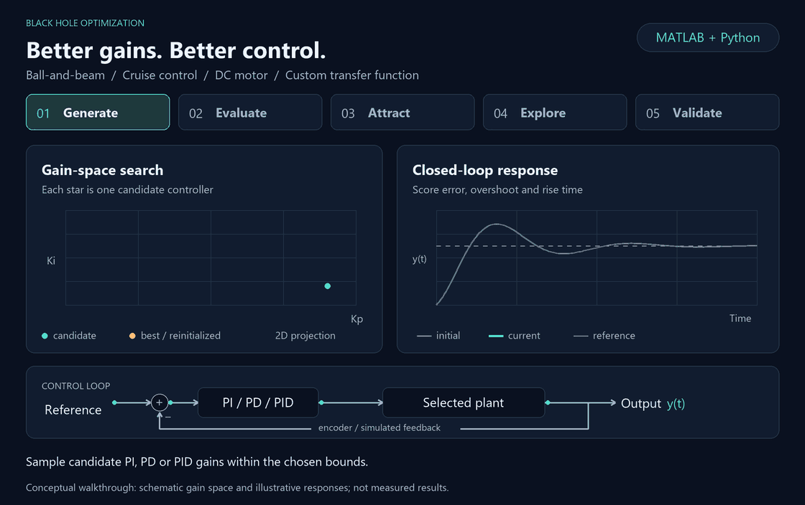

# BHO PID Optimizer

Black Hole Optimization (BHO) framework for tuning PI, PD and PID controllers on three dynamic systems (ball-and-beam, cruise control, DC motor), with a Ziegler-Nichols benchmark and an experimental validation on a real Arduino-based DC-motor prototype.

Final-year project, Electrical Engineering, School of Power and Automation Engineering, Bahrain Polytechnic.

<p align="center">
  <a href="https://github.com/Abdulla-22/BHO-PID-Optimizer/releases">
    
  </a>
  <a href="LICENSE">
    
  </a>
</p>

<p align="center">
  Windows 10/11, 64-bit &nbsp;|&nbsp; <a href="https://github.com/Abdulla-22/BHO-PID-Optimizer/releases">Installer and release notes</a>
</p>

---

## Animated walkthrough



[View the static diagram](docs/assets/bho-workflow-static.png) · [Animation source and regeneration instructions](docs/assets/README.md)

1. **Generate:** choose a plant and PI, PD or PID controller, then sample candidate gains within the search bounds.
2. **Evaluate:** simulate each closed-loop response and score tracking error, overshoot, rise time and steady-state error. The lowest-cost star becomes the black hole.
3. **Attract:** move the other stars toward the best gain vector and evaluate the updated candidates.
4. **Explore:** replace stars absorbed by the event horizon with new candidates, then repeat the search.
5. **Validate:** compare the tuned response with Ziegler-Nichols. For the DC motor prototype, the separate hardware application evaluates candidates using measured encoder feedback.

*The animation uses schematic gain positions and illustrative response curves. Actual simulation and hardware results are reported below; the diagram does not imply that simulated gains transfer directly to hardware.*

---

## Contents

- [Animated walkthrough](#animated-walkthrough)
- [Overview](#overview)
- [Key results](#key-results)
- [Repository structure](#repository-structure)
- [Getting started](#getting-started)
- [Method](#method)
- [Hardware prototype](#hardware-prototype)
- [Limitations](#limitations)
- [Documentation and citation](#documentation-and-citation)
- [License and third-party materials](#license-and-third-party-materials)
- [Authors](#authors)

---

## Overview

PI, PD and PID controllers are widely used, but their performance depends strongly on the chosen gains. This project treats the controller gains as decision variables of the Black Hole Optimization algorithm. Each candidate gain set is evaluated by simulating the closed-loop system and scoring the step response with a multi-criterion cost function.

The project provides:

- A **MATLAB optimization framework** with a MATLAB App Designer GUI for simulation-based tuning.
- A **Python desktop application** (Black Hole Optimizer) with step-by-step visualization of the algorithm.
- A **Python application for direct hardware tuning** of a DC motor through an Arduino.
- **Simulink models, cost functions, results and test data** for all three plants.

### Supported systems and controllers

| System | Controllers | Plant model |
|---|---|---|
| Ball-and-beam | PD, PID | $`G_b(s)=\dfrac{R(s)}{\Theta(s)}`$, ball position per gear angle |
| Cruise control | PI, PD, PID | $`G_c(s)=\dfrac{V(s)}{U(s)}`$, vehicle speed per applied force |
| DC motor (speed) | PI, PD, PID | $`G_m(s)=\dfrac{\Omega(s)}{V_a(s)}`$, motor speed per armature voltage |
| Custom transfer function | PI, PD, PID | User-defined numerator and denominator (MATLAB tools) |

The plant models used in the simulations are:

$$G_b(s)=\frac{R(s)}{\Theta(s)}=\frac{m g d}{L\left(J/R_b^{2}+m\right)}\cdot\frac{1}{s^{2}}$$

$$G_c(s)=\frac{V(s)}{U(s)}=\frac{1}{m s+b}$$

$$G_m(s)=\frac{\Omega(s)}{V_a(s)}=\frac{K}{(J s+b)(L s+R)+K^{2}}$$

The controller is $`C(s)=K_p+\dfrac{K_i}{s}+K_d\,s`$. For PI and PD controllers the unavailable term is excluded.

PI is not used for the ball-and-beam plant because derivative damping is needed. PD on the cruise-control plant leaves a steady-state error because it has no integral action.

---

## Key results

All values below are taken from the accompanying paper. Simulation results come from ideal, unconstrained models.

### Simulation: BHO vs Ziegler-Nichols (PID)

| Plant | Method | Rise time (s) | Settling time (s) | Overshoot (%) |
|---|---|---|---|---|
| Ball-and-beam | BHO | 0.016335 | 0.020010 | 0.090731 |
| Ball-and-beam | Ziegler-Nichols | 0.377806 | 18.211522 | 69.866398 |
| Cruise control | BHO | 2.337471 | 4.131540 | 0.000014 |
| Cruise control | Ziegler-Nichols | 1.861391 | 8.863628 | 15.108353 |
| DC motor | BHO | 0.001608 | 0.001970 | 0.000000 |
| DC motor | Ziegler-Nichols | 0.088888 | not available | 20.357998 |

BHO gave much lower overshoot in all three cases. Ziegler-Nichols reached a faster rise time on the cruise-control plant. The results show trade-offs between methods, not a universal advantage of one method.

### Repeatability (10 independent PID runs per plant)

| Plant | Best cost | Mean cost | Std. dev. | Coefficient of variation |
|---|---|---|---|---|
| Ball-and-beam | 0.00052863 | 0.00064200 | 1.0714e-4 | 16.69 % |
| Cruise control | 0.03659000 | 0.03860800 | 1.2586e-3 | 3.26 % |
| DC motor | 0.00047412 | 0.00047976 | 3.1821e-6 | 0.663 % |

Cost values are comparable only within the same plant, because the weights and simulation durations differ per plant.

### Hardware validation (DC motor prototype)

Direct BHO tuning on the physical motor gave $`K_p = 3.169`$, $`K_i = 1.098`$, $`K_d = 0.114`$.

| Test | Reference (r/min) | Mean measured (r/min) | RMSE (r/min) | Mean PWM |
|---|---|---|---|---|
| Fixed reference, lower disturbance | 50 | 49.88 | 0.55 | 174.35 |
| Fixed reference, higher disturbance | 50 | 47.99 | 2.09 | 190.03 |
| Bidirectional tracking (+50, +30, -30, -50, +50) | as stated | within 0.6 r/min of the reference in every segment | below 0.7 for every segment | 116 to 181 |

Higher mechanical disturbance required more PWM effort (about 9 % higher mean PWM) to hold the same speed.

---

## Repository structure

```text
BHO-PID-Optimizer/
├── MATLAB - BHA/
│   ├── MATLAB Optimization Files/      # Script-based optimization and stochastic analysis
│   │   ├── main.m                      # Entry point: select system, controller and mode
│   │   ├── Costs Functions/            # cost_ballandbeam, cost_cruise, cost_motor, cost_custom
│   │   ├── Initialization/             # init_ballandbeam, init_cruise, init_motor
│   │   ├── Tuning Methods/             # BlackHoleAlgorithm.m, ZieglerNichols.m
│   │   ├── Simulink Models/            # PI, PD, PID models for each system (incl. custom TF)
│   │   ├── Results/                    # BallandBeam, CruiseControl, DCMotorSpeed, CustomSystem
│   │   └── BHO_PID_Stochastic_*        # Repeated-run analysis script and result tables
│   └── MATLAB Apps/
│       ├── MATLAB Optimizer App/       # BHA_App.mlapp and its support files
│       │   ├── Costs Functions/, Initialization/, Tuning Methods/, Simulink Models/
│       │   ├── Results/                # Saved app results (CruiseControl PI, CustomTF PI/PID)
│       │   └── images/                 # Algorithm visualization frames
│       └── Controlling DC Motor App/   # Controlling_DC_motor_app.mlapp and recorded motor responses
├── Python Apps/
│   ├── BHO.py                          # Black Hole Optimizer desktop app (simulation)
│   ├── Controlling_DC_Motor.py         # Direct BHO tuning on the real motor via serial
│   ├── Launcher.py                     # Starts both Python apps
│   ├── Filter_Tuner.py                 # Filter coefficient search (grid)
│   ├── Filter_Tuner_BHO.py             # Filter coefficient search (BHO)
│   ├── Instructions.txt, README.md     # Installation guide for the Python apps
│   └── images/                         # Algorithm visualization frames
├── Initial Testing and Coding/
│   ├── Unoptimized Systems/            # Ball-and-beam, cruise control, motor speed (Simulink and scripts)
│   ├── Arduino test/                   # Arduino sketches (motor without PID, PID motor)
│   ├── MATLAB Test/                    # Early BHA, motor-PID and Arduino-in-MATLAB scripts
│   └── motor_optimizing_parts/         # Motor step tests, system identification, optimization scripts
├── Drawings & 3D Designs/              # Prototype and conveyor SolidWorks parts, wiring_diagram.png
├── Multisim Tests/                     # Circuit simulations (.ms14)
├── Miscellaneous & Others/             # Motor test results, app screenshots, references, datasheet
├── docs/assets/                        # Animated walkthrough, static diagram and regeneration notes
├── scripts/                            # README animation generator
├── LICENSE                             # MIT license for original project material
├── THIRD_PARTY_NOTICES.md               # Dependency notices and external-material rights
└── README.md
```

---

## Getting started

### Option A: Windows installer (no Python needed)

1. Open the [Releases](https://github.com/Abdulla-22/BHO-PID-Optimizer/releases) page.
2. Download `BHO_Setup.exe` and run it.
3. Windows SmartScreen may show "Windows protected your PC" because the installer is not code-signed. Click **More info**, then **Run anyway**.

Requirements: Windows 10 or 11, 64-bit. Verify the download with the SHA-256 value published in the release notes.

### Option B: Run the Python apps from source

Requirements: Windows, Python 3.10 or newer.

```powershell
cd "Python Apps"
python -m venv env
.\env\Scripts\Activate.ps1
pip install customtkinter numpy scipy matplotlib pandas openpyxl pillow pyserial
python BHO.py
```

- `BHO.py`: simulation-based tuning with step-by-step visualization.
- `Controlling_DC_Motor.py`: direct tuning on the motor prototype. Requires the Arduino hardware and a serial connection.
- `Launcher.py`: starts both applications.

More details are in [`Python Apps/README.md`](Python%20Apps/README.md).

---

## Method

### Black Hole Optimization

Each star $`\mathbf{x}_i`$ encodes a gain vector: $`[K_p, K_i]`$, $`[K_p, K_d]`$ or $`[K_p, K_i, K_d]`$. Stars are initialized uniformly within the gain limits. The star with the lowest cost is the black hole $`\mathbf{x}_{BH}`$, and every other star moves toward it:

$$\mathbf{x}_i^{t+1}=\mathbf{x}_i^{t}+r_i\left(\mathbf{x}_{BH}^{t}-\mathbf{x}_i^{t}\right),\qquad r_i\sim\mathcal{U}(0,1)$$

The event-horizon radius and the distance of star $`i`$ to the black hole are:

$$R_{EH}=\frac{f_{BH}}{\sum_{n=1}^{N} f_n},\qquad D_i=\left\lVert \mathbf{x}_{BH}-\mathbf{x}_i\right\rVert_2$$

where $`f_i=J(\mathbf{x}_i)`$ is the cost of star $`i`$, $`f_{BH}`$ is the lowest cost in the population and $`N`$ is the number of stars. A star with $`D_i < R_{EH}`$ is absorbed and re-initialized randomly within the gain limits, which maintains search diversity. The published simulations used 100 stars and 100 iterations.

### Simulation objective

Each candidate is scored on its closed-loop step response:

$$J=w_1\,IAE_n+w_2\,E_{OS}+w_3\,E_{RT}+w_4\,E_{SS}$$

$$e(t)=r(t)-y(t),\qquad IAE_n=\frac{\int_0^{T}\lvert e(t)\rvert\,dt}{\lvert r\rvert\,T}$$

$$E_{OS}=\frac{OS}{100},\qquad E_{RT}=\frac{t_r}{T},\qquad E_{SS}=\frac{\lvert r-y(T)\rvert}{\lvert r\rvert}$$

Here $`r`$ is the reference amplitude, $`T`$ the simulation duration, $`OS`$ the overshoot in percent and $`t_r`$ the rise time (10 % to 90 %). If the simulation fails or returns an invalid response, a large penalty ($`J=10^{8}`$ or $`J=10^{7}`$) is returned.

| Plant | $`w_1`$ | $`w_2`$ | $`w_3`$ | $`w_4`$ | $`T`$ (s) |
|---|---|---|---|---|---|
| Ball-and-beam | 0.20 | 0.30 | 0.25 | 0.25 | 20 |
| Cruise control | 0.15 | 0.30 | 0.25 | 0.30 | 20 |
| DC motor | 0.10 | 0.35 | 0.35 | 0.20 | 2 |

The tools provide two optimization modes: a **best-values** mode that minimizes the cost above, and a **wanted-values** mode in which the user specifies target overshoot, rise time and steady-state error. Results for both are stored under `Results/<System>/<Controller>/BestValuesMode` and `WantedValueMode`.

### Ziegler-Nichols benchmark

The ultimate gain $`K_u`$ and ultimate period $`T_u`$ are identified from sustained oscillation, then:

$$K_p=0.6\,K_u,\qquad K_i=\frac{1.2\,K_u}{T_u},\qquad K_d=0.075\,K_u\,T_u$$

The same response-extraction procedure is used for BHO and ZN.

### Stochastic evaluation

`BHO_PID_Stochastic_Analysis.m` repeats the PID optimization 10 times per plant (100 stars, 100 iterations, gains limited to $`0\le K_p,K_i,K_d\le 1000`$) and writes the summary tables (`BHO_PID_Stochastic_Summary.csv`, `BHO_PID_Stochastic_AllRuns.csv`, `BHO_PID_Stochastic_PaperSummary.csv`).

---

## Hardware prototype

| Component | Description |
|---|---|
| Controller | Arduino Uno |
| Motor driver | BTS7960 |
| Actuator | Geared DC motor with encoder feedback |
| Supply | 12 V |

- Sampling interval: 50 ms. PWM limited to the range 0 to 255.
- Practical measures in the implementation: RPM and derivative filtering, anti-windup, PWM saturation, correction limiting, slew-rate limiting and a feedforward PWM term.
- BHO tuned the motor directly: each candidate gain set ran on the motor for 5 s, and a hardware-aware objective scored the measured response.

The hardware objective combines six dimensionless terms whose weights sum to one:

$$J_h=0.35\,ITAE_n+0.25\,e_{ss}+0.20\,\rho+0.10\,OS_n+0.05\,t_{r,n}+0.05\,\Delta u_n$$

where $`ITAE_n`$ is the normalized time-weighted absolute error, $`e_{ss}`$ the normalized steady-state error, $`\rho`$ the normalized speed ripple, $`OS_n`$ the normalized overshoot, $`t_{r,n}`$ the normalized rise time and $`\Delta u_n`$ the normalized mean PWM movement.

Wiring diagram and prototype images are in `Drawings & 3D Designs/`.

---

## Limitations

- Very fast simulated responses (ball-and-beam, DC motor) come from ideal models without supply and current limits, actuator saturation, encoder noise and quantization, sampling delay, friction or parameter variation. The large simulated gains are mathematical optimization results and should not be applied directly to hardware.
- The hardware results show practical tracking and disturbance rejection of the tuned prototype. They do not confirm the ideal transient times of the simulated model.
- The stochastic study measures the repeatability of the optimizer, not its robustness to plant uncertainty.
- No comparison with PSO, GA or DE is claimed. Industrial use would require broader testing and safety certification.
- The Windows build is not code-signed.

Future work: comparison with other metaheuristics, noise, saturation and parameter uncertainty in the optimization, additional repeated hardware trials, and hardware-aware constraints linking simulation and physical tuning.

---

## Documentation and citation

- Paper: *Black Hole Optimization-Based Controller Tuning for Dynamic Systems*, Bahrain Polytechnic.
- Thesis: *Optimal Tuning of Dynamic Systems Using the Black Hole Algorithm*, Bahrain Polytechnic, 2026.

If you use this work, please cite the paper above and link this repository.

---

## License and third-party materials

Original project code, documentation and the generated README animation are provided under the [MIT License](LICENSE), copyright © 2026 Ali Hubail, Abdulla Yusuf and Mujtaba Obaid. MIT permits use, modification and distribution, including commercial use, provided the copyright and permission notice are retained in copies or substantial portions. The software is provided without warranty. Academic citation is appreciated and adds no condition to the MIT license.

Third-party libraries, runtimes, reference papers, downloaded CAD models and other external materials retain their own licenses and rights. Some archived reference files have restricted or unverified redistribution permissions. Review [Third-party notices](THIRD_PARTY_NOTICES.md) before reusing or redistributing these materials; the project's MIT license does not grant rights to them.

The Windows packaging scripts include the project license and collect notices for the installed Python dependencies. MATLAB and Simulink must be obtained separately under MathWorks' terms.

---

## Authors

- **Ali Hubail** (author)
- **Abdulla Yusuf** (co-author)
- **Mujtaba Obaid** (co-author)

Supervisor: **Dr. Zakareya Hasan**, School of Power and Automation Engineering, Bahrain Polytechnic.
